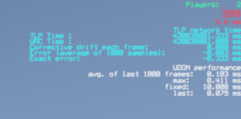

# Udon Profiling

Contains a simple ScreenSpace overlay for displaying Udon performance numbers.
It was originally based on a [version](https://gist.github.com/MerlinVR/2da80b29361588ddb556fd8d3f3f47b5) by [MerlinVR](https://github.com/merlinvr) (under MIT license) but has since been reworked and extended to fit my needs.

## Installation

1. Install VRChat World SDK 3.7
2. Install CyanPlayerObjectPool: https://cyanlaser.github.io/CyanPlayerObjectPool/
3. Install TLP UdonProfiling: https://guribo.github.io/TLP/

## Setup

Example scene with setup can be found in `Packages/tlp.udonprofiling/Runtime/Scenes/UdonProfilingDemo.unity`.
 
## Versioning

This package is versioned using [Semantic Version](https://semver.org/).

The used pattern MAJOR.MINOR.PATCH indicates: 

1. MAJOR version: incompatible API changes occurred
   - Implication: after updating backup, check and update your scenes/scripts as needed
2. MINOR version: new functionality has been added in a backward compatible manner
   - Implication: after updating check and update your usages if needed
3. PATCH version: backward compatible bug fixes were implemented
   - Implication: after updating remove potential workarounds you added

## Changelog

All notable changes to this project will be documented in this file.

### [2.2.0] - 2024-12-11

#### 🚀 Features

- Add editor execution order validation
- *(GlobalProfileHandler)* Improve error handling during start
- *(GlobalProfileKickoff)* Migrate to use SetupAndValidate
- *(PerformanceStatController)* Migrate to use SetupAndValidate
- Make ExecutionOrderReadOnly public
- Migrate to latest UdonUtils

#### 🐛 Bug Fixes

- Add ExecutionOrder attribute to every class

#### ⚙️ Miscellaneous Tasks

- Refresh scene
- Bump version

### [2.1.1] - 2024-08-20

#### ⚙️ Miscellaneous Tasks

- Remove redundant dependencies, update to UdonUtils 9.0.0

### [2.1.0] - 2024-06-02

#### 🚀 Features

- Add fast and slow update mode

#### ⚙️ Miscellaneous Tasks

- Support UdonUtils 8.2.0

### [2.0.2] - 2024-05-25

#### ⚙️ Miscellaneous Tasks

- Migrate to UdonUtils fix 8.1.0

### [2.0.1] - 2024-05-25

#### ⚙️ Miscellaneous Tasks

- Migrate to UdonUtils 8.0.0
- Update demo scene

### [2.0.0] - 2024-05-16

#### 🚀 Features

- *(UI)* [**breaking**] Rework network stats, add new information of TLP network time, simplify setup

### [1.1.2] - 2024-05-10

#### ⚙️ Miscellaneous Tasks

- Support com.vrchat.worlds 3.6.x and Unity 2022.3.22

### [1.1.1] - 2024-04-19

#### ⚙️ Miscellaneous Tasks

- Support UdonUtils 6.0.0

### [1.1.0] - 2024-04-14

#### 🚀 Features

- Update to UdonUtils 5.3.0

### [1.0.2] - 2024-04-14

#### 🐛 Bug Fixes

- *(Prefabs)* Remove redundant VrcNetworkTime and update sample scene

### [1.0.1] - 2024-04-14

#### 🐛 Bug Fixes

- *(Ui)* Fix incorrect unit of server time error

### [1.0.0] - 2024-04-11

#### 🚀 Features

- Initial commit
- Update to syncmode none
- Add files again but without lfs
- Change layers and make objects static that can be
- Update to U## 1.0 and client sim
- Fix loglevels, assert and perf limit warning
- Add gamemode, update vr components, test improvements, add serialization retry to base behaviour
- Add logging of all logs in frame to profiler
- Use UUIDs instead
- Update base behaviour
- Fix up scenes and broken event callbacks
- Display data in leaderboard entry
- Add more events for different executionorder sections, refactor executionorder on most scripts
- Update tribes scene, create leaderboard prefab
- Convert basic performance stats to model view controller
- Update profiler ui, update leaderboard scene
- Fix players spawning in triggers not being detected by audio zone
- Add dirty property to event
- Reduce type spam in logs, add execution order to logs
- Add comparer creation, update exectionorders, move pooleable code to base behaviour
- Support adding players to model
- Update after utils restructure
- Update UVU exporter and readme
- Update namespaces, use NetworkTime
- Update assets
- Update prefab
- Convert to vpm and add ci

#### 🐛 Bug Fixes

- Unpack child prefabs
- Remove all files to fix lfs issues

#### 🧪 Testing

- Fix tests with debug enabled

<!-- generated by git-cliff -->
